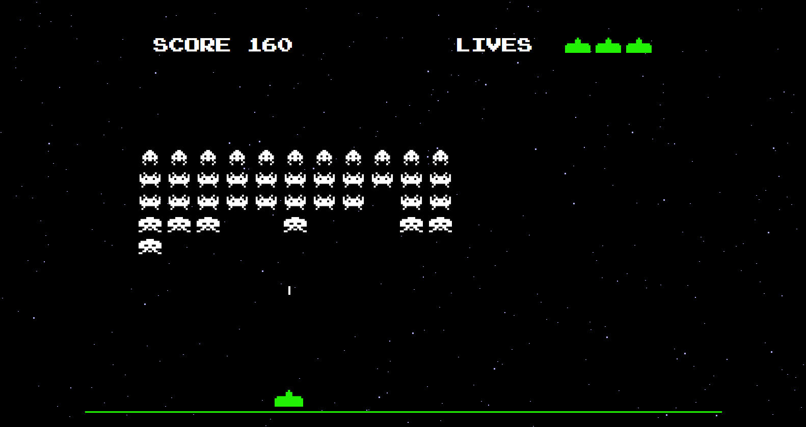
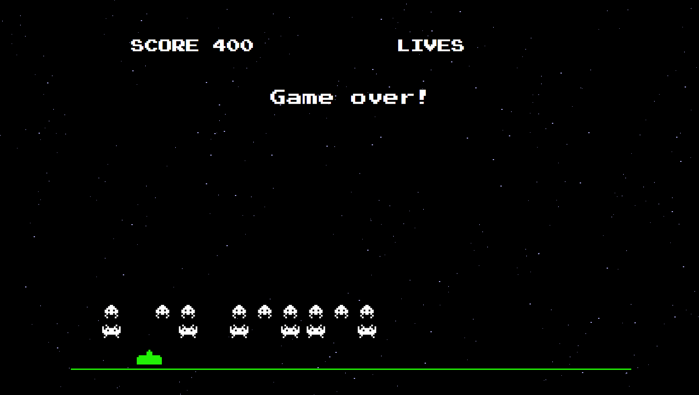

# Space Invaders

### About The Project
[Space Invaders](https://en.wikipedia.org/wiki/Space_Invaders) is a Japanese shooting video game released in 1978 by Taito. Modeled on the original game, this version is playable directly in the browser, 
using the arrow keys to move left and right, plus the spacebar to shoot.
 

### Live version [here](https://amy-spaceinvaders.netlify.app/).
 

### Built With
* HTML
* CSS
* JavaScript
 

## Gameplay screenshots

  
    
   

## Issues
There are no known issues; if you find a bug, please open an issue [here](https://github.com/AmyMaule/space-invaders/issues/new), including as much information as you can. 

## License
MIT © [Amy Maule](https://github.com/AmyMaule)
